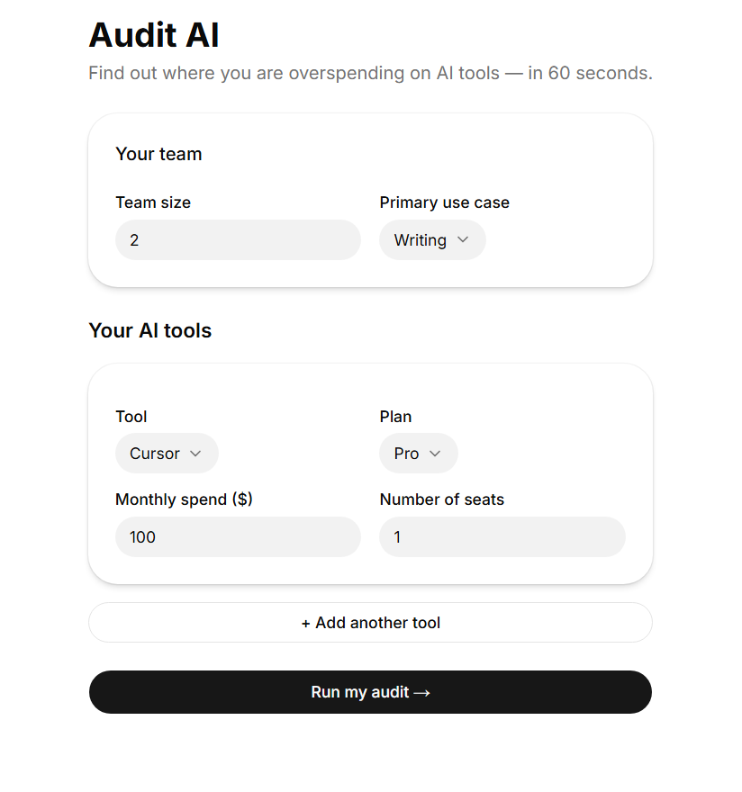
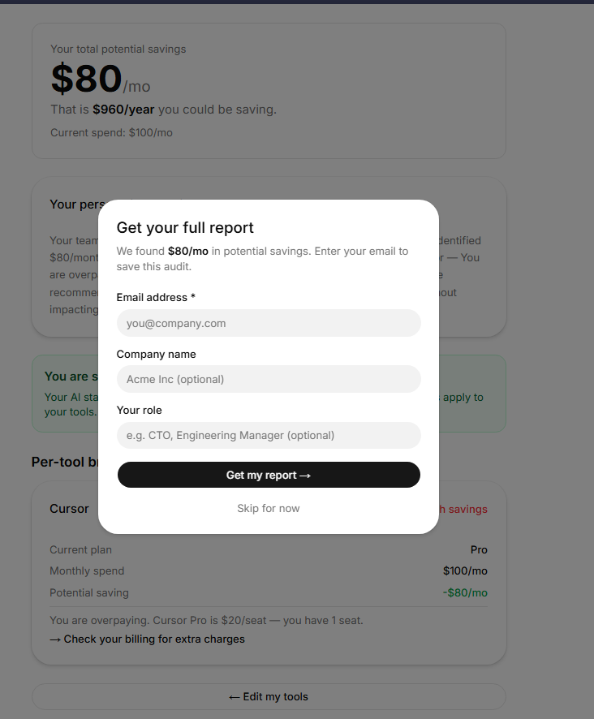
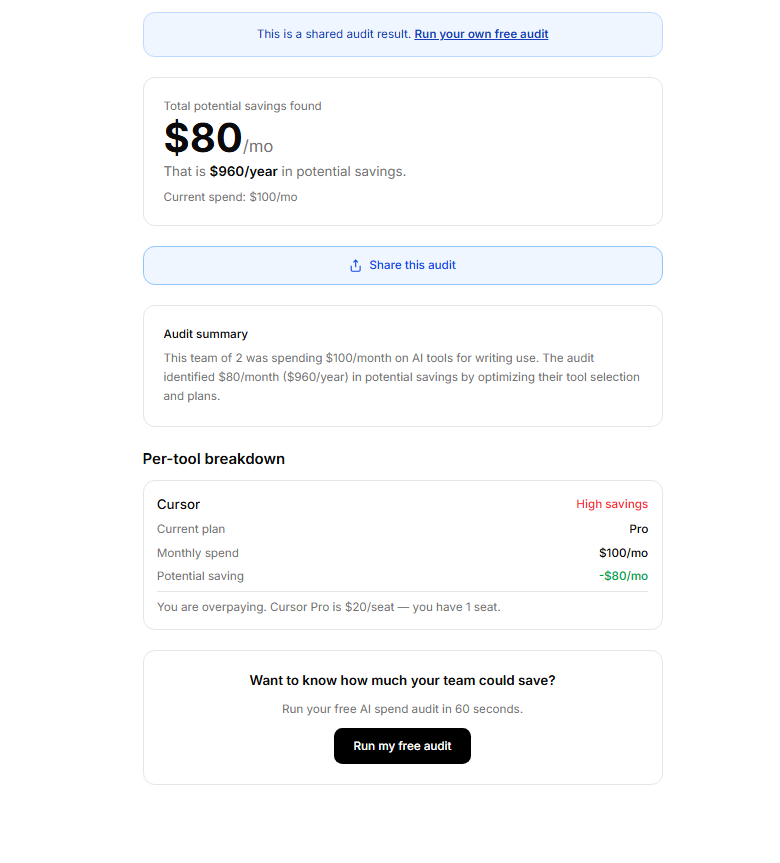

# Audit AI

A free web app that audits your AI tool spend and tells you exactly where your team is overspending — in 60 seconds. Built as a lead-generation tool for [Credex], which sells discounted AI credits to startups.

**Live:** https://audit-ai-hazel.vercel.app  
**Repo:** https://github.com/Abhinavv-933/Audit-AI

---

## Screenshots

### Spend input form


### Audit results with lead capture


### Shareable audit page


---

## Quick start

### Install

```bash
git clone https://github.com/Abhinavv-933/Audit-AI.git
cd Audit-AI
npm install
```

### Environment variables

Create a `.env.local` file at the root:

```
ANTHROPIC_API_KEY=your_anthropic_key
SUPABASE_URL=your_supabase_url
SUPABASE_ANON_KEY=your_supabase_anon_key
SUPABASE_SERVICE_KEY=your_supabase_service_key
RESEND_API_KEY=your_resend_key
NEXT_PUBLIC_BASE_URL=http://localhost:3000
```

### Run locally

```bash
npm run dev
```

Open [http://localhost:3000]

### Run tests

```bash
npm test
```

### Deploy

Push to `master` branch — Vercel auto-deploys. Add all environment variables to Vercel dashboard under Settings → Environment Variables.

---

## Decisions

**1. Hardcoded rules for the audit engine instead of AI**  
The audit logic uses pure TypeScript functions with hardcoded pricing rules, not AI. AI output is non-deterministic — if the same inputs produce different savings estimates on different runs, the tool loses credibility. A finance person needs to read the reasoning and agree with it. Hardcoded rules are testable, consistent, and defensible. AI is used only for the personalized summary paragraph where variability is acceptable.

**2. Next.js App Router over Pages Router**  
The shareable `/audit/[id]` page needs server-side rendering for Open Graph meta tags to work correctly on Twitter and Slack link previews. The App Router makes it trivial to mix server components (for OG tags) with client components (for the interactive form) in the same codebase. Pages Router would have required more boilerplate to achieve the same result.

**3. Supabase over a custom Postgres setup**  
Supabase gives a real SQL database with a REST API, row-level security, and a free tier that covers this use case — no server to manage, no connection pooling to configure. For a 7-day build, the time saved on infrastructure setup was worth the vendor dependency.

**4. Email captured after value is shown, never before**  
The assignment explicitly required this, and it is also the right product decision. Asking for email before showing results creates friction and distrust. Showing savings first, then asking for email to save the report, converts dramatically better. The modal appears after a 3-second delay to ensure the user has read the results.

**5. Fallback summary instead of blocking on Anthropic API**  
The AI summary calls the Anthropic API, which can fail due to rate limits, network issues, or insufficient credits. Rather than showing an error state, the app falls back to a templated summary generated from the same audit data. Users always see a complete, coherent result — they never see a broken page.

---

## Stack

- **Framework:** Next.js 16 with App Router and TypeScript
- **Styling:** Tailwind CSS + shadcn/ui (Luma preset)
- **Database:** Supabase (PostgreSQL)
- **AI:** Anthropic API (claude-sonnet-4-6)
- **Email:** Resend
- **Deployment:** Vercel
- **CI:** GitHub Actions
